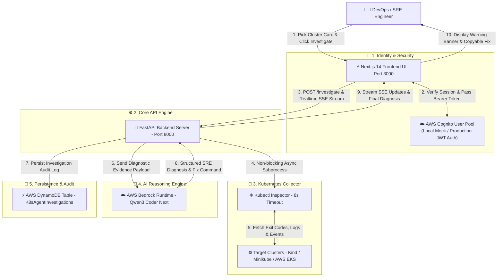
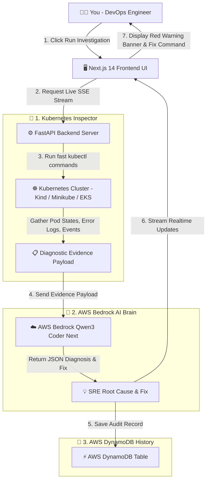

# 🚀 AI DevOps Kubernetes Agent (AWS Bedrock + SRE AI Engine)

Welcome to the **AI DevOps Kubernetes Agent**! 

Whether you are a **non-technical manager**, a **student beginner**, or a **senior SRE engineer**, this guide explains everything in simple, plain English with zero jargon confusion.

---

## 🏛️ High-Level System Architecture



### 🏛️ Architecture Layer Breakdown

| Layer | Component | Core Responsibility | Key Technology |
| :--- | :--- | :--- | :--- |
| **1. UI & Access** | **Next.js 14 Dashboard** | Interactive tile cards to select clusters, view streaming SSE step bars, and copy fix commands. | Next.js 14, React, Tailwind CSS |
| **2. Security** | **AWS Cognito** | Manages SRE Engineer authentication, OAuth 2.0 tokens, and local mock testing mode. | AWS Cognito User Pool, JWT Tokens |
| **3. Core Engine** | **FastAPI Server** | Coordinates evidence collection, streams real-time SSE updates, and invokes AI reasoning pipeline. | FastAPI, Python 3.9+, Asyncio |
| **4. Infrastructure** | **Kubectl Collector** | Non-blocking execution of `kubectl` commands with 8s timeouts to collect pods, error logs, and events. | Subprocess Exec, Kubectl CLI |
| **5. AI Brain** | **AWS Bedrock Runtime** | SRE AI model (`qwen.qwen3-coder-next`) that analyzes evidence payloads and generates structured root cause diagnoses. | AWS Bedrock, Boto3 Converse API |
| **6. Audit Storage** | **AWS DynamoDB** | Stores historical investigation reports with timestamps, confidence scores, and kubectl commands for post-mortem analysis. | AWS DynamoDB Table |

---

## 💡 What is this project? (The 1-Minute Story)

Imagine a huge factory with **hundreds of robots** (containers in Kubernetes). Every now and then, a robot stops working:
- Maybe it ran out of fuel (Memory / OOMKilled).
- Maybe someone gave it the wrong instruction manual (CrashLoopBackOff).
- Maybe it couldn't find the delivery truck (ImagePullBackOff).

Usually, human engineers have to read thousands of lines of scary log files to figure out why the robot stopped. 

**Our AI DevOps Agent is like a Super SRE Doctor.** It scans the entire factory, finds the broken robot in seconds, tells you **EXACTLY** why it broke, and gives you a single command to fix it!

---

## 🎨 1. Why do we have Frontend and Backend?

Think of our app like a car:

### 🖥️ Frontend (The Dashboard & Steering Wheel - Next.js 14)
- **What it is:** The beautiful web screen you see in your browser (`http://localhost:3000`).
- **Why we built it:** Nobody likes ugly text screens. The frontend gives you:
  - **Cluster Cards:** Clickable tiles to pick your target Kubernetes cluster (Kind, Minikube, or EKS).
  - **Live Progress Bar:** Shows real-time progress while scanning your cluster (`Checking Pods` ➔ `Reading Logs` ➔ `AI Reasoning`).
  - **Root Cause Warning Card:** Red/Amber warning banner showing the exact problem, AI confidence score, explanation, and a copyable `kubectl` fix command.

### ⚙️ Backend (The Engine & Brain - FastAPI + Python)
- **What it is:** The fast server running quietly in the background (`http://localhost:8000`).
- **Why we built it:** 
  - **Inspector:** Connects to Kubernetes and collects logs, events, pod statuses, and deployments in under 8 seconds.
  - **AI Engine:** Sends the collected logs to **AWS Bedrock Qwen AI** to figure out the root cause.
  - **Database Recorder:** Saves every past investigation into **AWS DynamoDB** so you never lose history.

---

## 🏗️ 2. How Everything Connects (Data Flow Diagram)

Here is a visual map showing how data flows step-by-step:



---

## ☁️ 3. AWS Services & Cognito Auth (Simple Breakdown)

| AWS Service | What it does in our app | Environment Config |
| :--- | :--- | :--- |
| **AWS Bedrock** | The AI brain (`qwen.qwen3-coder-next`). Reads broken pod logs and outputs beginner-friendly root cause explanations and fixes. | `AWS_BEDROCK_MODEL_ID=qwen.qwen3-coder-next` |
| **AWS DynamoDB** | The history database (`K8sAgentInvestigations`). Stores past investigation records so you can audit previous cluster issues. | `AWS_DYNAMODB_TABLE=K8sAgentInvestigations` |
| **AWS Cognito** | The security guard. Manages user logins and OAuth tokens to ensure only authorized SRE engineers can inspect clusters. | `NEXT_PUBLIC_ENABLE_COGNITO=false` (Local) / `true` (Prod) |

### 🔐 AWS Cognito: Local Mock vs Production Mode
- **Local Development Mode (`NEXT_PUBLIC_ENABLE_COGNITO=false`)**:
  - When running locally, Cognito is **mocked/bypassed** using browser `localStorage` (`aws_user_session`). This allows developers to work instantly without setting up AWS Cognito User Pools.
- **Production Mode (`NEXT_PUBLIC_ENABLE_COGNITO=true`)**:
  - Redirects users to the official AWS Cognito Hosted Login Page.
  - Sends a secure JWT Token in HTTP Headers (`Authorization: Bearer <JWT_TOKEN>`).
  - FastAPI verifies the token with AWS Cognito JWKS public keys before running cluster commands.

---

## ☁️ 4. End-to-End AWS Production Setup & Deployment Guide

Want to deploy this system completely on **AWS Production Infrastructure** just like we built it? Follow these step-by-step instructions:

### Step 1: AWS Credentials & IAM Setup
1. Create an AWS IAM User / Role with policy permissions:
   - `AmazonBedrockFullAccess`
   - `AmazonDynamoDBFullAccess`
   - `AmazonEKSClusterPolicy`
2. Configure AWS CLI on your system:
   ```bash
   aws configure
   # AWS Access Key ID: YOUR_ACCESS_KEY
   # AWS Secret Access Key: YOUR_SECRET_KEY
   # Default region name: ap-southeast-2
   ```

---

### Step 2: Request & Enable AWS Bedrock Model Access
1. Open the **AWS Console** $\rightarrow$ Navigate to **AWS Bedrock**.
2. Click **Model Access** in the left sidebar.
3. Select **Qwen / Bedrock Models** (e.g. `qwen.qwen3-coder-next`) and click **Save Changes / Request Access**.
4. Verify access by checking `AWS_BEDROCK_MODEL_ID=qwen.qwen3-coder-next` in `backend/.env`.

---

### Step 3: Create AWS DynamoDB History Table
1. Open **AWS DynamoDB Console** $\rightarrow$ **Tables** $\rightarrow$ **Create Table**.
   - **Table Name:** `K8sAgentInvestigations`
   - **Partition Key:** `id` (String)
   - **Table Class:** Standard
2. Or initialize automatically using Python script:
   ```bash
   python backend/scripts/init_dynamodb.py
   ```

---

### Step 4: Connect to AWS EKS Cluster (Elastic Kubernetes Service)
1. Update your local `kubectl` kubeconfig to point to your live AWS EKS cluster:
   ```bash
   aws eks update-kubeconfig --region ap-southeast-2 --name eks-cluster
   ```
2. Verify node connectivity:
   ```bash
   kubectl get nodes
   ```

---

### Step 5: AWS Cognito Production Authentication Setup
1. Open **AWS Cognito Console** $\rightarrow$ **Create User Pool**.
   - **User Pool Name:** `k8s-agent-user-pool`
   - **App Client Name:** `k8s-agent-web-client`
2. Enable **Cognito Hosted UI** and configure App Client OAuth settings.
3. Set environment flag in `frontend/.env.local` to enable production authentication:
   ```env
   NEXT_PUBLIC_ENABLE_COGNITO=true
   NEXT_PUBLIC_COGNITO_USER_POOL_ID=ap-southeast-2_xxxxxxxxx
   NEXT_PUBLIC_COGNITO_CLIENT_ID=xxxxxxxxxxxxxxxxxxxxxxxxxx
   ```

---

### Step 6: Deploy Backend Container to AWS ECR & AWS App Runner / ECS
1. Create ECR Repository and Push Backend Image:
   ```bash
   aws ecr create-repository --repository-name k8s-agent-backend --region ap-southeast-2
   docker build -t <aws_account_id>.dkr.ecr.ap-southeast-2.amazonaws.com/k8s-agent-backend:latest ./backend
   docker push <aws_account_id>.dkr.ecr.ap-southeast-2.amazonaws.com/k8s-agent-backend:latest
   ```
2. Launch service via **AWS App Runner** or **AWS ECS Fargate**, passing the required AWS environment variables.

---

### Step 7: Deploy Frontend to AWS Amplify / Vercel
1. Deploy `frontend` directory to AWS Amplify or Vercel.
2. Set `NEXT_PUBLIC_API_BASE_URL` to your production backend URL (e.g. `https://api.yourdomain.com`).

---

## 🐳 5. How to Run Locally with Docker & Docker Compose (Easiest Way!)

Want to run the entire app with **ONE single command** before deploying to AWS? Use Docker Compose!

### Prerequisites
- Install **Docker Desktop** on Mac/Windows/Linux.
- A local Kubernetes cluster (`kind` or `minikube`) or running `kubectl`.

### Step 1: Clone Repository
```bash
git clone https://github.com/singhdeepanshu20-droid/AI-DevOps-Kubernetes-Agent.git
cd AI-DevOps-Kubernetes-Agent
```

### Step 2: Set Environment Variables
Copy `.env.example` to `.env` in the root folder and in `backend/`:
```bash
cp .env.example .env
cp backend/.env.example backend/.env
```

### Step 3: Run with Docker Compose
```bash
docker compose up --build
```

That's it! 
- **Frontend App:** Open `http://localhost:3000` in your browser.
- **Backend API:** Live at `http://localhost:8000`.
- *Note:* Docker automatically mounts your local `~/.kube/config` so the backend container can read your Kubernetes clusters.

---

## 🛠️ 6. How to Run Locally Without Docker (Python + Node.js)

If you prefer running Frontend and Backend manually in separate terminals:

### Step 1: Start Backend (FastAPI)
```bash
# Setup Python Environment
python3 -m venv venv
source venv/bin/activate
pip install -r backend/requirements.txt

# Start Backend Server
cd backend
../venv/bin/uvicorn app.main:app --host 0.0.0.0 --port 8000 --reload
```

### Step 2: Start Frontend (Next.js)
In a second terminal window:
```bash
cd frontend
npm install
npm run dev
```
Open `http://localhost:3000` in your browser.

---

## ⚡ 7. How to Test Real Kubernetes Failure Scenarios

Want to test how the AI Agent detects real cluster failures? We have 4 pre-built test manifests!

Run any of these `kubectl` commands in your terminal:

```bash
# Test 1: Pod crashing due to missing database URL (CrashLoopBackOff)
kubectl apply -f k8s_test_scenarios/01-crashloopbackoff.yaml

# Test 2: Pod failing due to non-existent image tag (ImagePullBackOff)
kubectl apply -f k8s_test_scenarios/02-imagepullbackoff.yaml

# Test 3: Pod exceeding memory limits (OOMKilled)
kubectl apply -f k8s_test_scenarios/03-oomkilled.yaml

# Test 4: Service pointing to non-existent pod labels
kubectl apply -f k8s_test_scenarios/04-service-selector-mismatch.yaml
```

Now open `http://localhost:3000`, select your cluster card (e.g., `kind-kubernetes-demo-cluster`), click **Run Investigation**, and watch the AI Agent synthesize all issues in real-time!

---

## 🧹 8. Complete Project Cleanup Guide (Local & AWS)

When you are finished testing or want to tear down resources, follow these cleanup steps for local and AWS environments:

### 1. 🐳 Local Docker & Docker Compose Cleanup
If running via Docker Compose:
```bash
# Stop all containers, networks, and remove volumes
docker compose down -v

# (Optional) Clean up unused Docker images
docker system prune -f
```

---

### 2. 💻 Local Development Process Cleanup (Python + Node.js)
If running servers directly in your terminal:
```bash
# Stop FastAPI Backend (Kill process on port 8000)
lsof -ti :8000 | xargs kill -9

# Stop Next.js Frontend (Kill process on port 3000)
lsof -ti :3000 | xargs kill -9
```

---

### 3. ☸️ Local Kubernetes Test Pods Cleanup
Remove test failure manifests from your local cluster (`Kind` / `Minikube`):
```bash
kubectl delete -f k8s_test_scenarios/01-crashloopbackoff.yaml
kubectl delete -f k8s_test_scenarios/02-imagepullbackoff.yaml
kubectl delete -f k8s_test_scenarios/03-oomkilled.yaml
kubectl delete -f k8s_test_scenarios/04-service-selector-mismatch.yaml

# Delete any manual test pods
kubectl delete pod nginx-crash nginx-imagepullbackoff --ignore-not-found
```

---

### 4. ☁️ AWS Cloud Infrastructure Teardown

If you deployed resources to AWS, run these commands to avoid unnecessary AWS costs:

#### A. Delete AWS DynamoDB Table
```bash
aws dynamodb delete-table --table-name K8sAgentInvestigations --region ap-southeast-2
```

#### B. Delete AWS ECR Backend Repository & Images
```bash
aws ecr delete-repository --repository-name k8s-agent-backend --region ap-southeast-2 --force
```

#### C. Delete AWS Cognito User Pool
```bash
# List User Pools to find YOUR_USER_POOL_ID
aws cognito-idp list-user-pools --max-results 10 --region ap-southeast-2

# Delete Cognito User Pool
aws cognito-idp delete-user-pool --user-pool-id YOUR_USER_POOL_ID --region ap-southeast-2
```

#### D. Delete AWS EKS Cluster (If created for testing)
```bash
aws eks delete-cluster --name eks-cluster --region ap-southeast-2
```
